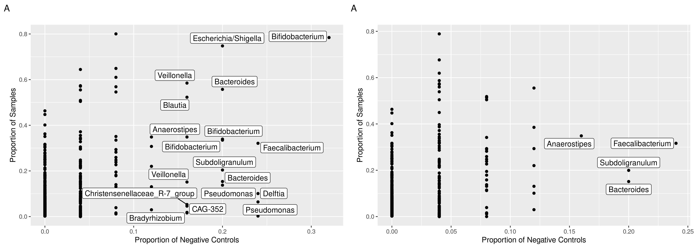

```{r, setup, include=FALSE}
knitr::opts_knit$set(root.dir = 'assets/')
```

# From Sequencer to ASV Table

After your sequencing run is complete, there are a few methods to obtain the sequencing data in its raw format for downstream analysis. (1) Download directly from the sequencer itself with an external drive, or (2) download from BaseSpace, assuming the run has been linked.

### A. Download From Sequencer

Insert an external drive into the sequencer's USB port. There should be at least 100GB of space on the external drive. Runs typically have around 60GB of data, but it's always safest to have more space.

Navigate to the location of the raw run data. You are looking for a folder formatted like: `190826_NS500170_0076_AH772CBGXC`. The first six numbers are the date in YYMMDD format, the second section is the name of the machine and machine number (NextSeq 500 #170), the third section is the run number (here the 76th run on our NextSeq), and the last section is a letter code related to an ID on the Flow Cell (not important, just FYI).

If you need to use this method, you may need to set up a call with Katie to determine exactly where this directory lives (once Katie recalls, this document will be updated), but once you've located it, you click and drag the directory to your external drive and wait for the run to download. This takes approximately 1-2 hours. Once it's complete, you can disconnect the drive.

Once downloaded, you will upload the data to Wynton where we will do all sequence data processing:

Start by plugging your drive into your computer. If you have a Mac, there are two Terminal commands that can upload data: `scp` and `rsync`. There are benefits to both, but for the purpose of uploading sequence data, scp is better because it gives informative progress text. An example usage for your needs would be:

```
scp -r ~/Volumes/MyDrive/190826_NS500170_0076_AH772CBGXC/ {username}@dt2.wynton.ucsf.edu:/wynton/group/lynch/NextSeq_data/
```

A couple of things to note:

- The -r option means that it will upload all of the files within the run directory.

- Here we are uploading using the data transfer node on Wynton (hence, dt2), which offers much faster upload speeds than using a login node. We are also uploading to a directory on Wynton where our raw runs live. This is important for downstream processing.

If you are running on a Windows machine, you will have more success with software like FileZilla and using an SFTP connection (port 22!). Speak with Katie if you need support with this.

You will now need to upload the mapping file using the same method as above, and it will need to be saved in `/wynton/group/lynch/NextSeq_Processed/mapping_files`. This will then set you up perfectly for processing the data using the developed script.

## B. Download from BaseSpace

In order to download from BaseSpace, the first thing you will need to do is download the Command Line Interface (CLI) for BaseSpace following the directions here `https://developer.basespace.illumina.com/docs/content/documentation/cli/cli-overview` using the Linux method. You will want to install onto Wynton in your home (`~`) directory. Specifically run the following commands on Wynton:

```
cd ~
wget "https://api.bintray.com/content/basespace/BaseSpaceCLI-EarlyAccess-BIN/latest/\$latest/amd64-linux/bs?bt_package=latest" -O $HOME/bin/bs
chmod u+x $HOME/bin/bs
~/bin/bs auth
```

The output will be a link that you copy into your browser, and you will sign into basespace, thereby linking the `bs` command to your account. You will only need to do this once. Once complete, return to the command line.

There are several options available once you have BaseSpace installed. Review the link above to find the commands you need. Commands like `~/bin/bs list run` will list out all of the runs that are available to you, including the project identifier, which will be helpful when downloading (`~/bin/bs download run --id {id}`). I would suggest going to the `/wynton/group/lynch/NextSeq_data/` directory before running the download command so that the run downloads to our raw run directory.

# Pipeline #1 (QIIME-based/Original/Version 1)

You will now need to upload the mapping file using the scp command (From your computer: `scp /my/mapping/file {username}@dt2.wynton.ucsf.edu:/wynton/group/lynch/NextSeq_Processed/mapping_files/`). This will then set you up perfectly for processing the data using the developed script.

## Required Rules for QIIME-based Mapping Files

Mapping files need to be in a *very* specific format for the software we use to be able to read them in correctly. You can find all of the details [here](http://qiime.org/documentation/file_formats.html) or [here](https://gls9000.gitbooks.io/qiime-tutorial-for-illumina-paired-end-sequences/content/1_preparing_the_data/14_preparing_a_mapping_file.html). The long-and-short of it is that your mapping file may not pass QC for a number of reasons (one of the main reasons the pipeline will break within the first 10 minutes). The Rules are:

1. The file should be named with the same date as the run (so `Nextseq_YYMMDD_mapping.txt` matching `YYMMDD_Nextseq500_...`). PLEASE DO THIS. It matches a run to mapping file. Three years down the road, we won't care that you made your mapping file two days after you started the run, we just want to know what run it's for.

2. Should be a tab-delimited file (txt)

3. The first variable needs to be "#SampleID" (with the hashtag/pound sign, and all applicable capitalization)

4. Second and third columns should be BarcodeSequence and LinkerPrimerSequence, in that order, though LinkerPrimerSequence contents don't matter (I believe). Barcode sequence *definitely* matters

5. No duplicate column names

6. While periods (.) are okay, you can't use underscores (_), dashes(-), or **any other special characters** in the file

7. We have also discussed adding other descriptive columns to the mapping file including final DNA concentration or 16S copy number, just as additional QC checks if we need to make sure a sample's composition is consistent with other measured factors from processing

8. The last column needs to be called "Description" and be filled with the sample name again

9. Finally, all negative controls and empty wells should use "NTC" and "EMTPY" respectively in the **SampleType** variable. This is the variable used in the Negative Control filtering step to identify negative controls in the dataset. If the script breaks at the negative control filtering step, this is a very likely culprit.

Katie is working with Claire to initiate some cross-talk between AirTable and Wynton. This is in process. For now, once you have a mapping file that works for a run, it can stay in the mapping file directory.

An example of an older mapping file that works with the script, with sample names changed to generic. Clearly you want to make sure that the sample names match up with the data you're about to analyze. This dummy file can be downloaded from the [Lynch Lab Pipeline website](https://lynchlab-ucsf.github.io).

```{r, echo=FALSE, results='asis', message=FALSE}
library(knitr)
library(kableExtra)
library(dplyr)
map <- read.table("Nextseq_YYMMDD_mapping.txt", header=TRUE, check.names=F, sep="\t", comment="")
map %>% 
  kable(format = "html",escape=F) %>% 
  kable_styling("striped", full_width=F) %>%
  add_header_above(c("Table 3"=nrow(.))) %>% 
  scroll_box(width = "120%", height = "5in")
```

## Processing a Raw NextSeq Run into an ASV table

Before you begin, if you have a SampleSheet.csv file in the raw run files, delete it! Katie has encountered unexpected bugs in the past due to this file.

The steps needed to process a NextSeq run and develop an ASV table have already been pipelined. Assuming the runs have been set up as above (run directory in /NextSeq_data/ and mapping file in /NextSeq_Processed/mapping_file/ with the modified formatting), you are almost ready to get started.

(1) Once logged into Wynton, ensure you're on one of the development nodes (dev1, dev2, dev3). If not, type: `ssh devX`, with X being 1, 2, or 3.
(2) Activate the current version of R in Wynton using : `module load CBI r`
(3) Run : `Rscript /wynton/group/lynch/kmccauley/mySoftware/install_packages.R`
This will install any packages that are missing before starting the processing steps. The code will tell you what packages are missing and will install them automatically. If all needed packages are already installed, you will get a message saying as much. You should always run this script before processing a run, as the version of R may have changed.

Once complete, start processing the run:

```
cd /wynton/group/lynch/NextSeq_Processed/
qsub -M {your-email} scripts/complete_16s_pipeline.sh 190826_NS500170_0076_AH772CBGXC Nextseq_190826_mapping.txt
```

The -M option will send you an e-mail when the process finishes. `scripts/complete_16s_pipeline.sh` is the name of the bash file with all of the commands. `190826_NS500170_0076_AH772CBGXC` is the run name. `Nextseq_190826_mapping.txt` is the mapping file (which should live in the mapping_files directory). After several hours (16-24), you will have the following directories in the directory for this run within NextSeq_Processed:

- `submission`: This directory contains all of your R1 and R2 files separated by sample ID. This is what gets uploaded to SRA and also what is used for DADA2.

- `FASTQC` contains the results from FASTQC. You can scp the files to your computer for viewing in a browser.

- `dada2_output` contains all of the files generated from DADA2. These include:
  - TrackedReadsThruDADA2.csv
  - TaxonomyBootstraps.csv
  - {runname}_seqs.txt (Just the ASVs)
  - {runname}_tax_table.txt (Taxonomy Table from DADA2)
  - {runname}_tax_table_DECIPHER.txt (Taxonomy Table from DECIPHER)
  - {runname}_otutable.txt (ASV Table of counts)
  - dada2_result_object.RData (Final dada2 object -- if you need to troubleshoot something, you can load this object back into your environment)
  - dada2_phy_obj_raw.rds (Raw phyloseq object from the DADA2 script)
  - dada2_optim_tree.tre (Tree built from sequences)
  - dada2_phy_pruned_wtree.rds (Phyloseq object with non-bacteria removed, low-prevalence filtering, and a tree object)
  - Combined_Cleaning_Figure.pdf (Figure generated before and after negative control filtering -- definitely review this figure to confirm that the defaults)
  - phyloseq_noneg.rds (Final phyloseq object with negative control signal removed as per the figure)

The file that you will use for subsequent analysis is `phyloseq_noneg.rds`.

### Steps in the Script

#### bcl2fastq

Illumina's proprietary hyper-compressed files are called BCL (or base call) files. They can be easily transformed into usable fastq (Q because the quality information is included) files using this command. We're not providing a mapping file, so all obtained reads are placed into "Undetermined" files, which means that the script wasn't able to associate a barcode with a sample name. This is fine and expected. You will get separate files for R1 and R2 (read 1 and read 2 / forward and reverse), and the script also prints a file with the associated barcodes.

#### Undetermined FASTQC

Next, we perform FASTQC on the large undetermined files, which means that we are getting an overall quality profile of the reads. This gives us an additional sense if anything went awry with the run.

#### Split Libraries

"Splitting libraries" is essentially the practice of assigning a sample name to a read, and this is done with your well-formatted mapping file through QIIME1. It matches the barcode from the FASTQ file of barcodes to the list of barcodes in your mapping file and creates a new "pool" of sequences that have been assigned to a sample.

#### Poly-G Filter

The NextSeq in particular is on a two-color system. That means that by using just red and green colors, it can relay information for all four nucleotides. How, you ask? Through permutation! In other words, only green and only red are two nucleotides, but you get the other two by doing both and neither, respectively! How cool!!! Except.... Gs are created when you get neither light, and sometimes you can get neither light for reasons beyond a G nucleotide, creating long stretches of Gs in your sequence data. This makes DADA2 unhappy, so I am using bbduk to filter out these "poly G" reads using an entropy (or sequence similarity score) of 0.2.

#### Make Sample-Specific FASTQs

Pretty straight-forward. Just makes one fastq file for each of the forward and reverse reads for each sample, which is the input to DADA2's algorithm.

# Pipeline #2 (Illumina Sample Sheet/Version 2)

We are also working on developing a pipeline that will allow us to utilize the Illumina-formatted Sample Sheet. The components in this pipeline are essentially the same as noted above, except that we're using Illumina's bcl2fastq to perform the split libraries step. QIIME is being considered for phase-out because of the move to QIIME2, and the prevailing belief among reviewers that using anything related to QIIME1 is now out-dated and problematic. (/rant)

## Rules for the Illumina Sample Sheet

The rules associated with the Illumina Sample Sheet are annoyingly different, but relatively simple compared to the QIIME sample sheet -- this list will increase in length as additional rules need to be followed. Specifically:

1. Sample names can only contain '-' and '_' as non-alphanumeric characters. Which means no periods, slashes, etc, etc.

2. The '[Data]' row should be the 18th row on the sample sheet, followed immediately by the table. Katie is working on a possible script to make this less of a point, but it's not quite ready yet. Reach out to Katie when you have difficulty with this point.

3. Naming convention -- despite either (I haven't decided yet) uploading the sample sheet directly to Illumina OR providing it in the run's directory, I do eventually want to build a database of mapping files that can be accessed from the server, OR finding some way to take the mapping file and upload it to AirTable as part of the pipeline (you can theoretically interact with AirTable using a CLI, and I'm interested in exploiting this...). *ANYWAY, please adhere to our previous rules about file naming conventions, using something like: `NextSeq_YYMMDD_mapping.csv` (noting the CSV format this time, and keeping YYMMDD matching the run's version).*

## Using the new script

You will now need to upload the sample sheet using the scp command (From your computer: `scp /my/sample/sheet.csv {username}@dt2.wynton.ucsf.edu:/wynton/group/lynch/NextSeq_Processed/mapping_files/`). This will then set you up perfectly for processing the data using the developed script.

Next, log in to Wynton, and *copy* the uploaded mapping file from the mapping files directory into the directory specific to your newly-uploaded run. `cp /wynton/group/lynch/NextSeq_Processed/mapping_files/NextSeq_YYMMDD_mapping.csv /wynton/group/lynch/NextSeq_data/{my run ID}`.

Finally, you can initiate the script by running: 

```
cd /wynton/group/lynch/NextSeq_Processed/
qsub scripts/complete_16s_pipeline_v2.sh 190826_NS500170_0076_AH772CBGXC Nextseq_190826_mapping.csv
```

# Post-Processing Steps

Low-prevalence filtering and negative control signal filtering are both part of our "usual" processing and filtering methods for most datasets and are completed automatically as part of the script above. Multiply-rarefying, however, is a process that requires a few additional steps to identify the optimal depth, so it needs to be done manually.

### 1. Low-prevalence filtering

Next, we want to remove any SVs in our table that may be contaminants, or generally present in extremely low counts relative to our total count, cutting down on noise in our data. This is typically 0.0001% of the total read count in your dataset.

### 2. Negative control filtering

Next, we use a script to remove signal deriving from the negative controls from our samples. This form of negative control filtering outright removes any SVs found in more than 15% of your negative controls and less than 15% of samples. Among the SVs that remaine, the average read count within negative controls is subtracted from the read count in samples, and negative numbers are returned to 0.

The script then returns a NTC-filtered phyloseq object. Also output by the script is a figure showing the distribution of taxa before and after running the script (Combined_Cleaning_Figure.pdf). An example output is shown here (this plot coming from running the same example SV table through the NTC script):



We can tell from this figure that taxa like **Pseudomonas** and **Delftia** were removed, and while some taxa also present in negative controls remain, they are very likely to be biologically meaningful. Further examination of this data (not shown) found that remaining taxa had a very low total read count within the negative controls. Hence, the lack of movement of those taxa.

# Normalizing for Differences in Read Depth

All microbiome data needs to be normalized for differences in read depth. This can be done through either Multiply Rarefying or Variance Stabilized Transformations.

Considerations for your own dataset should be driven by the questions you wish to answer. Our preference is for multiply-rarefying, but if you have low-abudance samples that you cannot filter out you may want to consider variance-stabilized transformations.

### A. Rarefying

Rarefying means to sub-sample each sample to an even read depth. We use a method for representative rarefaction in which we subsample each sample 100 times and choose the randomized sample at the center of a distance matrix. However, before we can carry out this process, we need to determine the optimal depth. This depth is that at which there is no additional diversity to gain and you retain an optimal number of samples (samples with a read depth lower than the rarefying depth are removed).

I have built a script to carry out this process. In order to use it, you can run:

```
Rscript /wynton/group/lynch/kmccauley/dada2_files/alpha_rarefaction.R phyloseq_noneg.rds
```

This script runs slowly. Once it's done, you will get two outputs from this command (1) a table of read depths and the number of samples remaining at that read depth and (2) a figure representing the curves for each sample. In order to view a figure made on Wynton, you can copy it to your desktop using either your favorite FTP or the following scp command from your computer:

```
scp {username}@dt2.wynton.ucsf.edu:{image_location}/Alpha_Rarefaction_Curve.pdf ~/Downloads/
```

From this figure and the table, you want to identify the depth where diversity plateaus, but you don't end up losing many samples. In this example, we would likely pick something in the 50,000-70,000 read range, since diversity has plateaued and we start losing samples due to read depth soon after.

To initiate the multiply-rarefying step, you can run the following script from the location of your phyloseq object on Wynton.

```
Rscript /wynton/group/lynch/kmccauley/dada2_files/Multiply_Rarefy_phy.R phyloseq_noneg.rds 50000 phyloseq_mrare.rds
```

The first object is the name/location of the script. `phyloseq_noneg.rds` indicates the name of the input phyloseq object; `50000` is the planned read depth; `phyloseq_mrare.rds` is the name of the output object. If you'd rather not specify an output name, one will be chosen for you.

Let's say you're curious to know if the community composition of a dataset rarefied down to 50,000 reads and one that is rarefied at 70,000 reads. You can rarefy at both depths and then use a procrustes test to determine if their structure is significantly different. To do this, you can run something like the following:

```
Rscript /wynton/group/lynch/kmccauley/dada2_files/Multiply_Rarefy_phy.R phyloseq_noneg.rds 50000 phyloseq_mrare_50k.rds
Rscript /wynton/group/lynch/kmccauley/dada2_files/Multiply_Rarefy_phy.R phyloseq_noneg.rds 70000 phyloseq_mrare_70k.rds
Rscript /wynton/group/lynch/kmccauley/dada2_files/procrustes.R phyloseq_mrare_50k.rds phyloseq_mrare_70k.rds
```

The fun thing about the output is that if there is a significant P-value, it means that there is not a significant difference between the two datasets. It's strange, I know.

### B. Variance Stabilized Tranformations

We can also use the variance stabilized transformation, which can be applied before downstream analyses. Despite allowing for small read depths, you'll still want to consider removing samples with less than 1000 reads since those profiles may not be as robust. However, if you are working with ultra-low-burden samples you may not be able to do that either. As we start getting into some of these circumstances, a chat with Katie or Sue may be helpful in determining how best to move forward given your study.

```
library(DESeq2)
library(phyloseq)
## read in the saved RDS file:
phy <- readRDS("phyloseq_noneg.rds")
phy.filt <- subset_samples(phy, sample_sums(phy) > 1000) ## filter to samples with greater than 1000 reads
phy.vst <- phy.filt ## Initialize a new object where we'll save the VST object / keeps us from overwriting the original data.
deseqdat <- phyloseq_to_deseq2(phy.vst, ~1) ## We can use this ~1 as our "design formula" since we're looking to normalize the data.
deseqdat2 = estimateSizeFactors(deseqdat, type="poscounts")
otu_table(phy.vst) <- otu_table(counts(deseqdat2, normalized=TRUE),taxa_are_rows=TRUE) ## Update OTU table in the VST object we saved.
```

At this point, you're now ready to start the fun part! Analyzing and visualizing your data!

# Acknowlegements

Katie would like to give many thanks to Danny Li who helped develop the initial version of the analysis pipeline, as well as the several members of the Lynch Lab and BCMM who provided invaluable constructive feedback along the way.